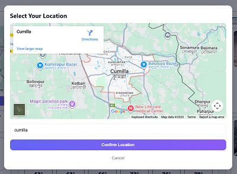
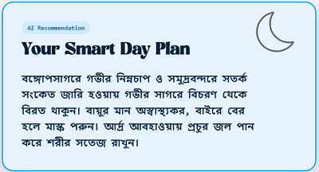

# How does it work?
1. Frontend makes a GET request on /api/weather/{city}. Ex: /api/weather/dhaka
2. django receives that request
   - fetches the weather data from "https://www.accuweather.com" with API call.
   - Then the django fetches the news article from The daily star and jugantor
   - Then django combines the weather data and news article and sends it to Gemini and gets the recommendation
   - Finally, the data is sent to the frontend as a JSON Response.

# How to use it? 
   - Render is a free hosting platform, so upon inactivity it suspends the server(frontend and backend).
   - So, go to the Backend url first and then frontend.
   - Wait for 1 minute. Render will then restart the servers. When backend and frontend both are running then change locations to see new recommendations.

# How you gonna know that backend is running?
"https://daymate-django.onrender.com/" will return -> {"status": "running", "message": "API is live!"} this json response.

# Live 
Frontend(live):  https://daymate-s7gj.onrender.com
Backend(live):  https://daymate-django.onrender.com

# Screenshots
## Location

## Local News

## Recommendation

